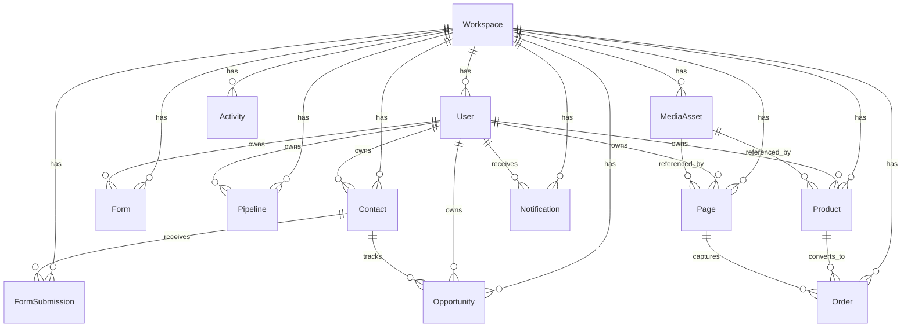

# Buy Now backend architecture

This backend uses MongoDB + Mongoose with a workspace-first model.

## Runtime model

- Use `POST /api/auth/bootstrap` to create or reuse a workspace and owner user.
- Pass `x-workspace-id` and `x-user-id` on authenticated requests.
- Public form and page views live under `/api/public`.
- Media binaries are stored in GridFS; metadata lives in `MediaAsset`.

## Core design

- `Workspace` is the tenant boundary.
- `User` belongs to a workspace.
- `Contact` is the unified lead/contact/customer record.
- `Form` owns field definitions and publishing settings.
- `FormSubmission` stores raw answers and metadata.
- `Pipeline` defines stage configuration.
- `Opportunity` tracks revenue-bearing work tied to a contact and pipeline stage.
- `Product` and `Page` power the sell and publish flows.
- `MediaAsset` stores metadata for GridFS-managed images and videos.
- `Order` stores checkout results.
- `Activity` is the append-only audit/event log.
- `Notification` is the user-facing inbox.
- `Workspace` and `User` support tenant-level access control and team management.

## Relationship map

## Collections

- `workspaces`
- `users`
- `contacts`
- `forms`
- `formsubmissions`
- `pipelines`
- `opportunities`
- `products`
- `pages`
- `mediaassets`
- `orders`
- `activities`
- `notifications`
- GridFS bucket: `media.files` and `media.chunks`

## Important indexes

- `workspaces.slug` unique
- `users.workspaceId + users.email` unique
- `contacts.workspaceId + contacts.email`
- `forms.workspaceId + forms.slug` unique
- `products.workspaceId + products.slug` unique
- `pages.workspaceId + pages.slug` unique
- `orders.workspaceId + orders.orderNumber` unique
- `mediaassets.workspaceId + mediaassets.gridFsFileId` index
- `activities.workspaceId + activities.occurredAt`
- `notifications.workspaceId + notifications.userId + notifications.readAt`

## API shape

- `GET /health`
- `GET /api/health`
- `POST /api/auth/bootstrap`
- `GET /api/auth/me`
- `GET /api/workspace/current`
- `PATCH /api/workspace/current`
- `GET /api/users`
- `POST /api/users`
- `GET /api/contacts`
- `POST /api/contacts`
- `GET /api/forms`
- `POST /api/forms`
- `POST /api/forms/:id/submissions`
- `GET /api/pipelines`
- `GET /api/pipelines/:id`
- `GET /api/opportunities`
- `POST /api/opportunities`
- `GET /api/products`
- `POST /api/products`
- `GET /api/pages`
- `POST /api/pages`
- `GET /api/orders`
- `POST /api/orders`
- `GET /api/activity`
- `GET /api/notifications`
- `PATCH /api/notifications/:id/read`
- `GET /api/dashboard/summary`
- `GET /api/public/forms/:slug`
- `POST /api/public/forms/:slug/submissions`
- `GET /api/public/pages/:slug`
- `POST /api/media` - upload image/video into GridFS and store metadata
- `GET /api/media/:id` - stream media from GridFS
- `DELETE /api/media/:id` - remove media metadata and GridFS blob

## Next implementation step

The main remaining work is product-specific polish:

- add request validation schemas for every route
- add pagination/search helpers for list endpoints
- add auth tokens or session cookies if the app needs real login
- add webhook/integration handlers for payments and publishing
