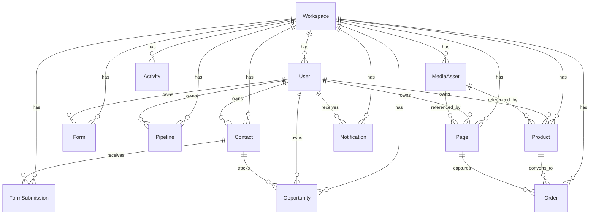

# Buy Now backend architecture

This backend uses MongoDB + Mongoose with a workspace-first model.

## Runtime model

- Use `POST /api/auth/register` and `POST /api/auth/login` for production sessions (HttpOnly cookie).
- `POST /api/auth/bootstrap` and `x-workspace-id` / `x-user-id` headers remain available **outside production only**.
- Public form and page views live under `/api/public`.
- Media binaries are stored in GridFS; metadata lives in `MediaAsset`.
- Private routes require a session and are scoped to the authenticated workspace.
- Cookie-authenticated mutating requests are origin-checked (CSRF). Auth and public form posts are rate limited.

## Core design

- `Workspace` is the tenant boundary.
- `User` belongs to a workspace with role `owner`, `admin`, or `member`.
- `Contact` is the unified lead/contact/customer record.
- `Form` owns field definitions and publishing settings.
- `FormSubmission` stores raw answers and metadata.
- `Pipeline` defines stage configuration.
- `Opportunity` tracks revenue-bearing work tied to a contact and pipeline stage.
- `Product` and `Page` power the sell and publish flows.
- `MediaAsset` stores metadata for GridFS-managed images and videos.
- `Order` stores checkout results.
- `Activity` is the append-only audit/event log.
- `Notification` is the user-facing inbox.
- `AuditLog` records permission and workspace administration changes.
- `PasswordReset` stores hashed, expiring reset tokens.

## Relationship map

## Auth

- `POST /api/auth/register`
- `POST /api/auth/login`
- `POST /api/auth/logout`
- `GET /api/auth/me`
- `POST /api/auth/forgot-password`
- `POST /api/auth/reset-password`
- `POST /api/auth/bootstrap` (non-production)

Password reset tokens are hashed and expire after one hour. In production the forgot-password response is generic (email delivery still needs SMTP). In development the response may include `resetToken` so the flow can be tested.

## Next implementation step

- SMTP/email delivery for password reset
- Form-field and page-section domain schemas
- Pagination for remaining collections
- Structured server logging
